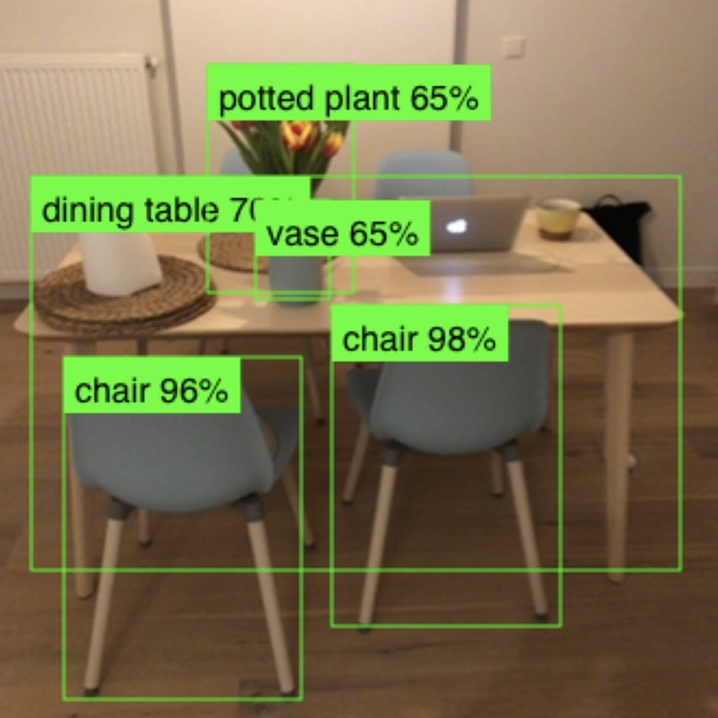

# 🤖 Machine Learning Experiments

Collection of interactive machine-learning experiments.

**How to use this repo**

**@TODO:** Finish this list

- See demo (how to apply models)
- See notebooks (how to train models)
- Checkout and play around locally
- Paste charts from https://arxiv.org/pdf/1611.10012.pdf (+ net configurations?)
- Comparison of CNN computer vision algorithms (Speed, accuracy, etc)
- Machine learning cycle diagram (Train, Deploy, Evaluate)
- Add a link to Homemade ML repo (See how to implement ML algorithms without frameworks)

## Demo

@TODO: Add demo link and instructions: http://trekhleb.github.io/machine-learning-experiments

## Experiments

<table>
  <thead>
    <tr>
      <th align="left" width="150" style="width: 150px !important"> </th>
      <th align="left">Experiment</th>
      <th align="left" width="140" style="width: 140px !important">Model training</th>
      <th align="left">Model usage</th>
      <th align="left">Tags</th>
      <th align="left">Dataset</th>
    </tr>
  </thead>
  <tbody>
    <!-- Experiment -->
    <tr>
      <td>
        
      </td>
      <td>
        <b>Handwritten digits recognition (MLP)</b>
      </td>
      <td>
        <a href="https://nbviewer.jupyter.org/v2/gh/trekhleb/machine-learning-experiments/blob/master/experiments/digits_recognition_mlp/digits_recognition_mlp.ipynb">
          
        </a>
        <a href="https://colab.research.google.com/github/trekhleb/machine-learning-experiments/blob/master/experiments/digits_recognition_mlp/digits_recognition_mlp.ipynb">
          
        </a>
      </td>
      <td>
        <a href="https://trekhleb.github.io/machine-learning-experiments/experiments/DigitsRecognitionMLP">
          ▶️&nbsp;Launch&nbsp;demo
        </a>
      </td>
      <td>
        <code>Multilayer&nbsp;Perceptron</code>,
        <code>MLP</code>,
        <code>Tensorflow</code>,
        <code>Keras</code>
      </td>
      <td>
        <a href="https://www.tensorflow.org/datasets/catalog/mnist">
          MNIST
        </a>
      </td>
    </tr>
    <!-- Experiment -->
    <tr>
      <td>
        
      </td>
      <td>
        <b>Handwritten digits recognition (CNN)</b>
      </td>
      <td>
        <a href="https://nbviewer.jupyter.org/v2/gh/trekhleb/machine-learning-experiments/blob/master/experiments/digits_recognition_cnn/digits_recognition_cnn.ipynb">
          
        </a>
        <a href="https://colab.research.google.com/github/trekhleb/machine-learning-experiments/blob/master/experiments/digits_recognition_cnn/digits_recognition_cnn.ipynb">
          
        </a>
      </td>
      <td>
        <a href="https://trekhleb.github.io/machine-learning-experiments/experiments/DigitsRecognitionCNN">
          ▶️&nbsp;Launch&nbsp;demo
        </a>
      </td>
      <td>
        <code>Convolutional&nbsp;NN</code>,
        <code>CNN</code>,
        <code>Tensorflow</code>,
        <code>Keras</code>
      </td>
      <td>
        <a href="https://www.tensorflow.org/datasets/catalog/mnist">
          MNIST
        </a>
      </td>
    </tr>
    <!-- Experiment -->
    <tr>
      <td>
        
      </td>
      <td>
        <b>Objects Detection (MobileNetV2)</b>
      </td>
      <td>
        <a href="https://nbviewer.jupyter.org/v2/gh/trekhleb/machine-learning-experiments/blob/master/experiments/objects_detection_ssdlite_mobilenet_v2/objects_detection_ssdlite_mobilenet_v2.ipynb">
          
        </a>
        <a href="https://colab.research.google.com/github/trekhleb/machine-learning-experiments/blob/master/experiments/objects_detection_ssdlite_mobilenet_v2/objects_detection_ssdlite_mobilenet_v2.ipynb">
          
        </a>
      </td>
      <td>
        <a href="https://trekhleb.github.io/machine-learning-experiments/experiments/ObjectsDetectionSSDLiteMobilenetV2">
          ▶️&nbsp;Launch&nbsp;demo
        </a>
      </td>
      <td>
        <code>Convolutional&nbsp;NN</code>,
        <code>MobileNetV2</code>,
        <code>SSDLite</code>,
        <code>CNN</code>,
        <code>Tensorflow</code>,
      </td>
      <td>
        <a href="http://cocodataset.org/#home">
          COCO
        </a>
      </td>
    </tr>
  </tbody>
</table>

## How to use this repository

### Virtual environment for Experiments

This environment is used to run Jupyter notebooks with experiments. This environment is used by default for further documentation. If some commands need to be run in another environment (i.e. in `converter` environment) this will be specified explicitly.

#### Create environment for Experiments

```bash
python3 -m venv .virtualenvs/experiments
```

#### Activate environment for Experiments

For `shell`:

```bash
source .virtualenvs/experiments/bin/activate
```

For `fish`:

```bash
source .virtualenvs/experiments/bin/activate.fish
```

### Virtual environment for Model Converter

This environment is used to convert the models that were trained during the experiments from `.h5` format to Javascript understandable formats (`.json` and `.bin`) for further usage in Demo application.

#### Create environment for Converter

```bash
python3 -m venv .virtualenvs/converter
```

#### Activate environment for Converter

For `shell`:

```bash
source .virtualenvs/converter/bin/activate
```

For `fish`:

```bash
source .virtualenvs/converter/bin/activate.fish
```

### Quitting virtual environments

```bash
deactivate
```

### Upgrading `pip`

```bash
pip install --upgrade pip
```

### Add new package (optional)

```bash
pip install package
```

### Save added package to `requirements.txt`

```bash
pip freeze > requirements.txt
```

To list installed packages for converter environment you should launch:

```bash
pip freeze > requirements.converter.txt
```

### Install packages

```bash
pip install -r requirements.txt
```

To install packages in `converter` environment run:

```bash
pip install -r requirements.converter.txt
```

### Launching Jupyter

```bash
jupyter notebook
```

### Converting the models

To convert `.h5` model to `.json` and `.bin` formats for further usage in JavaScript Demos you should use [tfjs-converter](https://github.com/tensorflow/tfjs/tree/master/tfjs-converter):

```bash
tensorflowjs_converter --input_format keras path/to/my_model.h5 path/to/tfjs_target_dir
```

For example:

```bash
tensorflowjs_converter --input_format keras \
  ./experiments/digits_recognition_mlp/digits_recognition_mlp.h5 \
  ./demos/public/models/digits_recognition_mlp
```

### Launching demos locally

```bash
cd demos
yarn install
yarn start
```
