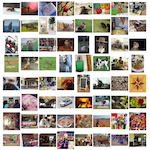

# 🤖 Interactive Machine Learning Experiments

This is a collection of interactive machine-learning experiments. Each experiment consists of Jupyter/Colab _notebook_ (to see how models were trained) and a _demo page_ (to try models in action right in your browser).

[▶️ Launch ML experiments demo](http://trekhleb.github.io/machine-learning-experiments)

> ⚠️ This repository contains machine learning **experiments** and **not** a production ready, reusable, optimised and fine-tuned code and models. This is rather a sandbox or a playground for learning and trying different machine learning approaches, algorithms and data-sets.

## Experiments

<table>
  <thead>
    <tr>
      <th align="left" width="150" style="width: 150px !important"> </th>
      <th align="left">Experiment</th>
      <th align="left" width="140" style="width: 140px !important">Model training</th>
      <th align="left">Model usage</th>
      <th align="left">Tags</th>
      <th align="left">Dataset</th>
    </tr>
  </thead>
  <tbody>
    <!-- Experiment -->
    <tr>
      <td>
        
      </td>
      <td>
        <b>Handwritten digits recognition (MLP)</b>
      </td>
      <td>
        <a href="https://nbviewer.jupyter.org/v2/gh/trekhleb/machine-learning-experiments/blob/master/experiments/digits_recognition_mlp/digits_recognition_mlp.ipynb">
          
        </a>
        <a href="https://colab.research.google.com/github/trekhleb/machine-learning-experiments/blob/master/experiments/digits_recognition_mlp/digits_recognition_mlp.ipynb">
          
        </a>
      </td>
      <td>
        <a href="https://trekhleb.github.io/machine-learning-experiments/experiments/DigitsRecognitionMLP">
          ▶️&nbsp;Launch&nbsp;demo
        </a>
      </td>
      <td>
        <code>Multilayer&nbsp;Perceptron</code>,
        <code>MLP</code>,
        <code>Tensorflow</code>,
        <code>Keras</code>
      </td>
      <td>
        <a href="https://www.tensorflow.org/datasets/catalog/mnist">
          MNIST
        </a>
      </td>
    </tr>
    <!-- Experiment -->
    <tr>
      <td>
        
      </td>
      <td>
        <b>Handwritten digits recognition (CNN)</b>
      </td>
      <td>
        <a href="https://nbviewer.jupyter.org/v2/gh/trekhleb/machine-learning-experiments/blob/master/experiments/digits_recognition_cnn/digits_recognition_cnn.ipynb">
          
        </a>
        <a href="https://colab.research.google.com/github/trekhleb/machine-learning-experiments/blob/master/experiments/digits_recognition_cnn/digits_recognition_cnn.ipynb">
          
        </a>
      </td>
      <td>
        <a href="https://trekhleb.github.io/machine-learning-experiments/experiments/DigitsRecognitionCNN">
          ▶️&nbsp;Launch&nbsp;demo
        </a>
      </td>
      <td>
        <code>Convolutional&nbsp;Neural&nbsp;Network</code>,
        <code>CNN</code>,
        <code>Tensorflow</code>,
        <code>Keras</code>
      </td>
      <td>
        <a href="https://www.tensorflow.org/datasets/catalog/mnist">
          MNIST
        </a>
      </td>
    </tr>
    <!-- Experiment -->
    <tr>
      <td>
        
      </td>
      <td>
        <b>Rock Paper Scissors (CNN)</b>
      </td>
      <td>
        <a href="https://nbviewer.jupyter.org/v2/gh/trekhleb/machine-learning-experiments/blob/master/experiments/rock_paper_scissors_cnn/rock_paper_scissors_cnn.ipynb">
          
        </a>
        <a href="https://colab.research.google.com/github/trekhleb/machine-learning-experiments/blob/master/experiments/rock_paper_scissors_cnn/rock_paper_scissors_cnn.ipynb">
          
        </a>
      </td>
      <td>
        <a href="https://trekhleb.github.io/machine-learning-experiments/experiments/RockPaperScissorsCNN">
          ▶️&nbsp;Launch&nbsp;demo
        </a>
      </td>
      <td>
        <code>Convolutional&nbsp;Neural&nbsp;Network</code>,
        <code>CNN</code>,
        <code>Tensorflow</code>,
        <code>Keras</code>
      </td>
      <td>
        <a href="http://www.laurencemoroney.com/rock-paper-scissors-dataset/">
          RPS
        </a>
      </td>
    </tr>
    <!-- Experiment -->
    <tr>
      <td>
        
      </td>
      <td>
        <b>Objects Detection (MobileNetV2)</b>
      </td>
      <td>
        <a href="https://nbviewer.jupyter.org/v2/gh/trekhleb/machine-learning-experiments/blob/master/experiments/objects_detection_ssdlite_mobilenet_v2/objects_detection_ssdlite_mobilenet_v2.ipynb">
          
        </a>
        <a href="https://colab.research.google.com/github/trekhleb/machine-learning-experiments/blob/master/experiments/objects_detection_ssdlite_mobilenet_v2/objects_detection_ssdlite_mobilenet_v2.ipynb">
          
        </a>
      </td>
      <td>
        <a href="https://trekhleb.github.io/machine-learning-experiments/experiments/ObjectsDetectionSSDLiteMobilenetV2">
          ▶️&nbsp;Launch&nbsp;demo
        </a>
      </td>
      <td>
        <code>Convolutional&nbsp;Neural&nbsp;Network</code>,
        <code>MobileNetV2</code>,
        <code>SSDLite</code>,
        <code>CNN</code>,
        <code>Tensorflow</code>,
      </td>
      <td>
        <a href="http://cocodataset.org/#home">
          COCO
        </a>
      </td>
    </tr>
    <!-- Experiment -->
    <tr>
      <td>
        
      </td>
      <td>
        <b>Image Classification (MobileNetV2)</b>
      </td>
      <td>
        <a href="https://nbviewer.jupyter.org/v2/gh/trekhleb/machine-learning-experiments/blob/master/experiments/image_classification_mobilenet_v2/image_classification_mobilenet_v2.ipynb">
          
        </a>
        <a href="https://colab.research.google.com/github/trekhleb/machine-learning-experiments/blob/master/experiments/image_classification_mobilenet_v2/image_classification_mobilenet_v2.ipynb">
          
        </a>
      </td>
      <td>
        <a href="https://trekhleb.github.io/machine-learning-experiments/experiments/ImageClassificationMobilenetV2">
          ▶️&nbsp;Launch&nbsp;demo
        </a>
      </td>
      <td>
        <code>Convolutional&nbsp;Neural&nbsp;Network</code>,
        <code>MobileNetV2</code>,
        <code>CNN</code>,
        <code>Tensorflow</code>,
      </td>
      <td>
        <a href="http://image-net.org/explore">
          ImageNet
        </a>
      </td>
    </tr>
  </tbody>
</table>

## How to use this repository locally

### Setup virtual environment for Experiments

```bash
# Create environment (launch it in the repository root folder).
python3 -m venv .virtualenvs/experiments

# Activate environment.
source .virtualenvs/experiments/bin/activate
# or if you use Fish shell...
source .virtualenvs/experiments/bin/activate.fish
```

To quit an environment just run:

```bash
deactivate
```

### Install dependencies

```bash
# Upgrade pip and setuptools to the latest versions.
pip install --upgrade pip setuptools

# Install packages
pip install -r requirements.txt
```

To add new packages run:

```bash
# Install new package.
pip install package-name

# Add new package to requirements.
pip freeze > requirements.txt
```

### Launch Jupyter locally

```bash
jupyter notebook
```

### Launch demos locally

```bash
cd demos
yarn install
yarn start
```

Demos will be available at `https://localhost:3000/`

## Converting Keras models into web-format for Demo app

The `converter` environment is used to convert the models that were trained during the experiments from `.h5` format to Javascript understandable formats (`.json` and `.bin`) for further usage in Demo application.

### Create environment for Converter

```bash
python3 -m venv .virtualenvs/converter
```

**Activate environment for Converter**

For `shell`:

```bash
source .virtualenvs/converter/bin/activate
```

For `fish`:

```bash
source .virtualenvs/converter/bin/activate.fish
```

### Install packages

To install packages in `converter` environment run:

```bash
pip install -r requirements.converter.txt
```

**Save added package to `requirements.requirements.txt`**

To list installed packages for converter environment you should launch:

```bash
pip freeze > requirements.converter.txt
```

### Converting the models

To convert `.h5` model to `.json` and `.bin` formats for further usage in JavaScript Demos you should use [tfjs-converter](https://github.com/tensorflow/tfjs/tree/master/tfjs-converter):

```bash
tensorflowjs_converter --input_format keras path/to/my_model.h5 path/to/tfjs_target_dir
```

For example:

```bash
tensorflowjs_converter --input_format keras \
  ./experiments/digits_recognition_mlp/digits_recognition_mlp.h5 \
  ./demos/public/models/digits_recognition_mlp
```

## Known Issues

[Issue](https://github.com/tensorflow/tensorflow/issues/33183)

Recommended Python versions: `> 3.7.3`.

In case if you have Python version `3.7.3` you might experience the following error when trying to `import tensorflow`:

```
RuntimeError: dictionary changed size during iteration
```
