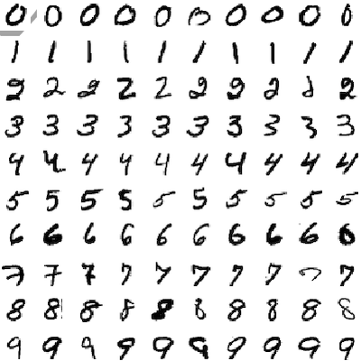
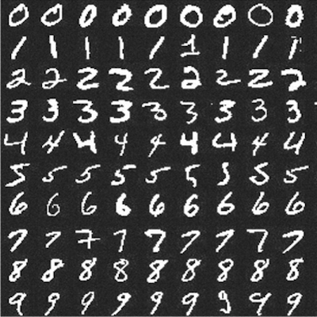
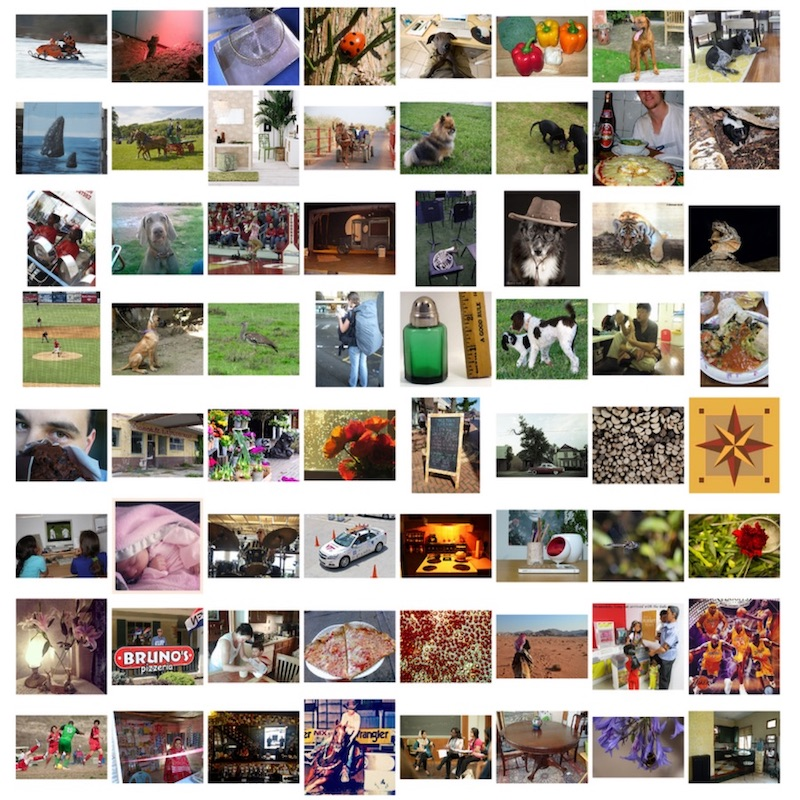

# 🤖 Interactive Machine Learning Experiments

This is a collection of interactive machine-learning experiments. Each experiment consists of 🏋️ Jupyter/Colab _notebook_ (to see how model was trained) and 🎨 _demo page_ (to see model in action right in your browser).

- 🎨 [Launch ML experiments demo](http://trekhleb.github.io/machine-learning-experiments)
- 🏋️ [Launch ML experiments Jupyter notebooks](https://nbviewer.jupyter.org/github/trekhleb/machine-learning-experiments/tree/master/experiments/)

<hr/>

> ⚠️ This repository contains machine learning **experiments** and **not** a production ready, reusable, optimised and fine-tuned code and models. This is rather a sandbox or a playground for learning and trying different machine learning approaches, algorithms and data-sets. Models might not perform well and there is a place for overfitting/underfitting.

## Experiments

Most of the models in these experiments were trained using [TensorFlow 2](https://www.tensorflow.org/) with [Keras](https://www.tensorflow.org/guide/keras/overview) support.

### Supervised Machine Learning

[Supervised learning](https://en.wikipedia.org/wiki/Supervised_learning) is when you have input variables `X` and an output variable `Y` and you use an algorithm to learn the mapping function from the input to the output: `Y = f(X)`. The goal is to approximate the mapping function so well that when you have new input data `X` that you can predict the output variables `Y` for that data. It is called supervised learning because the process of an algorithm learning from the training dataset can be thought of as a teacher supervising the learning process.

#### Multilayer Perceptron (MLP)

A [multilayer perceptron](https://en.wikipedia.org/wiki/Multilayer_perceptron) (MLP) is a class of feedforward artificial neural network (ANN). Multilayer perceptrons are sometimes referred to as "vanilla" neural networks (composed of multiple layers of perceptrons), especially when they have a single hidden layer. It can distinguish data that is not linearly separable.

<table>
  <thead>
    <tr>
      <th align="left" width="150" style="width: 150px !important"> </th>
      <th align="left" width="200" style="width: 200px !important">Experiment</th>
      <th align="left" width="140" style="width: 140px !important">Model demo & training</th>
      <th align="left">Tags</th>
      <th align="left" width="140" style="width: 140px !important">Dataset</th>
    </tr>
  </thead>
  <tbody>
    <!-- Experiment -->
    <tr>
      <td>
        
      </td>
      <td>
        <b>Handwritten digits recognition (MLP)</b>
      </td>
      <td>
        <a href="https://trekhleb.github.io/machine-learning-experiments/experiments/DigitsRecognitionMLP">
          
        </a>
        <a href="https://nbviewer.jupyter.org/v2/gh/trekhleb/machine-learning-experiments/blob/master/experiments/digits_recognition_mlp/digits_recognition_mlp.ipynb">
          
        </a>
        <a href="https://colab.research.google.com/github/trekhleb/machine-learning-experiments/blob/master/experiments/digits_recognition_mlp/digits_recognition_mlp.ipynb">
          
        </a>
      </td>
      <td>
        <code>MLP</code>
      </td>
      <td>
        <a href="https://www.tensorflow.org/datasets/catalog/mnist">
          MNIST
        </a>
      </td>
    </tr>
  </tbody>
</table>

#### Convolutional Neural Networks (CNN)

A [convolutional neural network](https://en.wikipedia.org/wiki/Convolutional_neural_network) (CNN, or ConvNet) is a class of deep neural networks, most commonly applied to analyzing visual imagery (photos, videos). They are used for detecting and classifying objects on photos and videos, style transfer, face recognition, pose estimation etc.

<table>
  <thead>
    <tr>
      <th align="left" width="150" style="width: 150px !important"> </th>
      <th align="left" width="200" style="width: 200px !important">Experiment</th>
      <th align="left" width="140" style="width: 140px !important">Model demo & training</th>
      <th align="left">Tags</th>
      <th align="left" width="140" style="width: 140px !important">Dataset</th>
    </tr>
  </thead>
  <tbody>
    <!-- Experiment -->
    <tr>
      <td>
        
      </td>
      <td>
        <b>Handwritten digits recognition (CNN)</b>
      </td>
      <td>
        <a href="https://trekhleb.github.io/machine-learning-experiments/experiments/DigitsRecognitionCNN">
          
        </a>
        <a href="https://nbviewer.jupyter.org/v2/gh/trekhleb/machine-learning-experiments/blob/master/experiments/digits_recognition_cnn/digits_recognition_cnn.ipynb">
          
        </a>
        <a href="https://colab.research.google.com/github/trekhleb/machine-learning-experiments/blob/master/experiments/digits_recognition_cnn/digits_recognition_cnn.ipynb">
          
        </a>
      </td>
      <td>
        <code>CNN</code>
      </td>
      <td>
        <a href="https://www.tensorflow.org/datasets/catalog/mnist">
          MNIST
        </a>
      </td>
    </tr>
    <!-- Experiment -->
    <tr>
      <td>
        
      </td>
      <td>
        <b>Rock Paper Scissors (CNN)</b>
      </td>
      <td>
        <a href="https://trekhleb.github.io/machine-learning-experiments/experiments/RockPaperScissorsCNN">
          
        </a>
        <a href="https://nbviewer.jupyter.org/v2/gh/trekhleb/machine-learning-experiments/blob/master/experiments/rock_paper_scissors_cnn/rock_paper_scissors_cnn.ipynb">
          
        </a>
        <a href="https://colab.research.google.com/github/trekhleb/machine-learning-experiments/blob/master/experiments/rock_paper_scissors_cnn/rock_paper_scissors_cnn.ipynb">
          
        </a>
      </td>
      <td>
        <code>CNN</code>
      </td>
      <td>
        <a href="http://www.laurencemoroney.com/rock-paper-scissors-dataset/">
          RPS
        </a>
      </td>
    </tr>
    <!-- Experiment -->
    <tr>
      <td>
        
      </td>
      <td>
        <b>Rock Paper Scissors (MobilenetV2)</b>
      </td>
      <td>
        <a href="https://trekhleb.github.io/machine-learning-experiments/experiments/RockPaperScissorsMobilenetV2">
          
        </a>
        <a href="https://nbviewer.jupyter.org/v2/gh/trekhleb/machine-learning-experiments/blob/master/experiments/rock_paper_scissors_mobilenet_v2/rock_paper_scissors_mobilenet_v2.ipynb">
          
        </a>
        <a href="https://colab.research.google.com/github/trekhleb/machine-learning-experiments/blob/master/experiments/rock_paper_scissors_mobilenet_v2/rock_paper_scissors_mobilenet_v2.ipynb">
          
        </a>
      </td>
      <td>
        <code>MobileNetV2</code>,
        <code>Transfer learning</code>,
        <code>CNN</code>
      </td>
      <td>
        <a href="http://www.laurencemoroney.com/rock-paper-scissors-dataset/">
          RPS
        </a>,
        <a href="http://image-net.org/explore">
          ImageNet
        </a>
      </td>
    </tr>
    <!-- Experiment -->
    <tr>
      <td>
        
      </td>
      <td>
        <b>Objects Detection (MobileNetV2)</b>
      </td>
      <td>
        <a href="https://trekhleb.github.io/machine-learning-experiments/experiments/ObjectsDetectionSSDLiteMobilenetV2">
          
        </a>
        <a href="https://nbviewer.jupyter.org/v2/gh/trekhleb/machine-learning-experiments/blob/master/experiments/objects_detection_ssdlite_mobilenet_v2/objects_detection_ssdlite_mobilenet_v2.ipynb">
          
        </a>
        <a href="https://colab.research.google.com/github/trekhleb/machine-learning-experiments/blob/master/experiments/objects_detection_ssdlite_mobilenet_v2/objects_detection_ssdlite_mobilenet_v2.ipynb">
          
        </a>
      </td>
      <td>
        <code>MobileNetV2</code>,
        <code>SSDLite</code>,
        <code>CNN</code>
      </td>
      <td>
        <a href="http://cocodataset.org/#home">
          COCO
        </a>
      </td>
    </tr>
    <!-- Experiment -->
    <tr>
      <td>
        
      </td>
      <td>
        <b>Image Classification (MobileNetV2)</b>
      </td>
      <td>
        <a href="https://trekhleb.github.io/machine-learning-experiments/experiments/ImageClassificationMobilenetV2">
          
        </a>
        <a href="https://nbviewer.jupyter.org/v2/gh/trekhleb/machine-learning-experiments/blob/master/experiments/image_classification_mobilenet_v2/image_classification_mobilenet_v2.ipynb">
          
        </a>
        <a href="https://colab.research.google.com/github/trekhleb/machine-learning-experiments/blob/master/experiments/image_classification_mobilenet_v2/image_classification_mobilenet_v2.ipynb">
          
        </a>
      </td>
      <td>
        <code>MobileNetV2</code>,
        <code>CNN</code>
      </td>
      <td>
        <a href="http://image-net.org/explore">
          ImageNet
        </a>
      </td>
    </tr>
  </tbody>
</table>

#### Recurrent Neural Networks (RNN)

A [recurrent neural network](https://en.wikipedia.org/wiki/Recurrent_neural_network) (RNN) is a class of deep neural networks, most commonly applied to sequence-based data like speech, voice, text or music. They are used for machine translation, speech recognition, voice synthesis etc.

<table>
  <thead>
    <tr>
      <th align="left" width="150" style="width: 150px !important"> </th>
      <th align="left" width="200" style="width: 200px !important">Experiment</th>
      <th align="left" width="140" style="width: 140px !important">Model demo & training</th>
      <th align="left">Tags</th>
      <th align="left" width="140" style="width: 140px !important">Dataset</th>
    </tr>
  </thead>
  <tbody>
    <!-- Experiment -->
    <tr>
      <td>
        
      </td>
      <td>
        <b>Shakespeare Text Generation (RNN)</b>
      </td>
      <td>
        <a href="https://trekhleb.github.io/machine-learning-experiments/experiments/TextGenerationShakespeareRNN">
          
        </a>
        <a href="https://nbviewer.jupyter.org/v2/gh/trekhleb/machine-learning-experiments/blob/master/experiments/text_generation_shakespeare_rnn/text_generation_shakespeare_rnn.ipynb">
          
        </a>
        <a href="https://colab.research.google.com/github/trekhleb/machine-learning-experiments/blob/master/experiments/text_generation_shakespeare_rnn/text_generation_shakespeare_rnn.ipynb">
          
        </a>
      </td>
      <td>
        <code>LSTM</code>,
        <code>Character-based RNN</code>
      </td>
      <td>
        <a href="https://storage.googleapis.com/download.tensorflow.org/data/shakespeare.txt">
          Shakespeare
        </a>
      </td>
    </tr>
    <!-- Experiment -->
    <tr>
      <td>
        
      </td>
      <td>
        <b>Wikipedia Text Generation (RNN)</b>
      </td>
      <td>
        <a href="https://trekhleb.github.io/machine-learning-experiments/experiments/TextGenerationWikipediaRNN">
          
        </a>
        <a href="https://nbviewer.jupyter.org/v2/gh/trekhleb/machine-learning-experiments/blob/master/experiments/text_generation_wikipedia_rnn/text_generation_wikipedia_rnn.ipynb">
          
        </a>
        <a href="https://colab.research.google.com/github/trekhleb/machine-learning-experiments/blob/master/experiments/text_generation_wikipedia_rnn/text_generation_wikipedia_rnn.ipynb">
          
        </a>
      </td>
      <td>
        <code>LSTM</code>,
        <code>Character-based RNN</code>
      </td>
      <td>
        <a href="https://www.tensorflow.org/datasets/catalog/wikipedia">
          Wikipedia
        </a>
      </td>
    </tr>
  </tbody>
</table>

### Unsupervised Machine Learning

[Unsupervised learning](https://en.wikipedia.org/wiki/Unsupervised_learning) is when you only have input data `X` and no corresponding output variables. The goal for unsupervised learning is to model the underlying structure or distribution in the data in order to learn more about the data. These are called unsupervised learning because unlike supervised learning above there is no correct answers and there is no teacher. Algorithms are left to their own to discover and present the interesting structure in the data.

## How to use this repository locally

### Setup virtual environment for Experiments

```bash
# Create "experiments" environment (from the project root folder).
python3 -m venv .virtualenvs/experiments

# Activate environment.
source .virtualenvs/experiments/bin/activate
# or if you use Fish...
source .virtualenvs/experiments/bin/activate.fish
```

To quit an environment run `deactivate`.

### Install dependencies

```bash
# Upgrade pip and setuptools to the latest versions.
pip install --upgrade pip setuptools

# Install packages
pip install -r requirements.txt
```

To install new packages run `pip install package-name`. To add new packages to the requirements run `pip freeze > requirements.txt`.

### Launch Jupyter locally

In order to play around with Jupyter notebooks and see how models were trained you need to launch a [Jupyter Notebook](https://jupyter.org/) server.

```bash
# Launch Jupyter server.
jupyter notebook
```

Jupyter will be available locally at `http://localhost:8888/`. Notebooks with experiments may be found in `experiments` folder.

### Launch demos locally

Demo application is made on React by means of [create-react-app](https://github.com/facebook/create-react-app).

```bash
# Switch to demos folder from project root.
cd demos

# Install all dependencies.
yarn install

# Start demo server on http. 
yarn start

# Or start demo server on https (for camera access in browser to work on localhost).
yarn start-https
```

Demos will be available locally at `http://localhost:3000/` or at `https://localhost:3000/`.

### Convert models

The `converter` environment is used to convert the models that were trained during the experiments from `.h5` Keras format to Javascript understandable formats (`tfjs_layers_model` or `tfjs_graph_model` formats with `.json` and `.bin` files) for further usage with [TensorFlow.js](https://www.tensorflow.org/js) in [Demo application](http://trekhleb.github.io/machine-learning-experiments).

```bash
# Create "converter" environment (from the project root folder).
python3 -m venv .virtualenvs/converter

# Activate "converter" environment.
source .virtualenvs/converter/bin/activate
# or if you use Fish...
source .virtualenvs/converter/bin/activate.fish

# Install converter requirements.
pip install -r requirements.converter.txt
```

The conversion of `keras` models to `tfjs_layers_model`/`tfjs_graph_model` formats is done by [tfjs-converter](https://github.com/tensorflow/tfjs/tree/master/tfjs-converter):

For example:

```bash
tensorflowjs_converter --input_format keras \
  ./experiments/digits_recognition_mlp/digits_recognition_mlp.h5 \
  ./demos/public/models/digits_recognition_mlp
```

> ⚠️ Converting the models to a JS understandable formats and loading them to the browser directly might not be a good practice since in this case the user might need to load tens or hundreds of megabytes of data to the browser which is not efficient. Normally the model is being served from the back-end (i.e. [TensorFlow Extended](https://www.tensorflow.org/tfx)) and instead of loading it all to the browser the user will do a lightweight HTTP request to do a prediction. But since the [Demo App](http://trekhleb.github.io/machine-learning-experiments) is just an experiment and not a production-ready app and for the sake of simplicity (to avoid having an up and running back-end) we're converting the models to JS understandable formats and load them directly into the browser.

### Requirements

Recommended versions:

- Python: `> 3.7.3`.
- Node: `>= 12.4.0`.
- Yarn: `>= 1.13.0`.

In case if you have Python version `3.7.3` you might experience `RuntimeError: dictionary changed size during iteration` error when trying to `import tensorflow` (see the [issue](https://github.com/tensorflow/tensorflow/issues/33183)).

## You might be interested in

- [Homemade Machine Learning](https://github.com/trekhleb/homemade-machine-learning) - Python examples of popular machine learning algorithms with interactive Jupyter demos and math being explained.
- [NanoNeuron](https://github.com/trekhleb/nano-neuron) - 7 simple JavaScript functions that will give you a feeling of how machines can actually "learn".
- [Playground and Cheatsheet for Learning Python](https://github.com/trekhleb/learn-python) - Collection of Python scripts that are split by topics and contain code examples with explanations.
