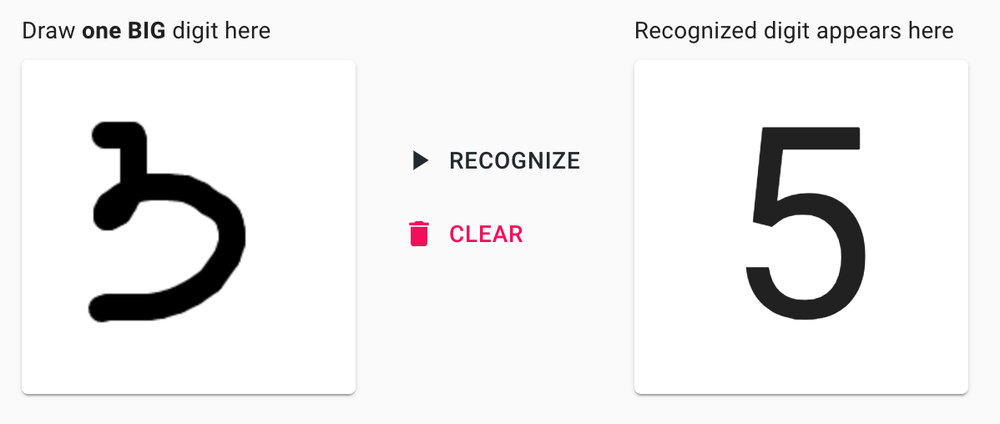
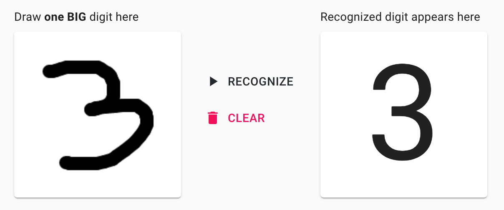

# 🤖 Interactive Machine Learning Experiments

## TL;DR

Hey readers!

I've open-sourced a new [**🤖 Interactive Machine Learning Experiments**](https://github.com/trekhleb/machine-learning-experiments) project on GitHub. Each experiment consists of 🏋️ _Jupyter/Colab notebook_ (to see how a model was trained) and 🎨 _demo page_ (to see a model in action right in your browser). 

Although the models may be a little dumb (remember, these are just experiments, not a production ready code), they will try to do their best to:

- 🖌 Recognize digits or sketches you draw in your browser
- 📸 Detect and recognize the objects you'll show to your camera
- 🌅 Classify your uploaded image
- 📝 Write a Shakespeare poem with you
- ✊🖐✌️ Play with you in Rock-Paper-Scissors game
- etc. 

I've trained the models on _Python_ using _TensorFlow 2_ with _Keras_ support  and then consumed them for a demo in a browser using _React_ and _JavaScript_ version of _Tensorflow_. 

## Models performance

⚠️ First, let's set our expectations.️ The repository contains machine learning **experiments** and **not** a production ready, reusable, optimised and fine-tuned code and models. This is rather a sandbox or a playground for learning and trying different machine learning approaches, algorithms and data-sets. Models might not perform well and there is a place for overfitting/underfitting.

Therefore, sometimes you might see things like this:

But be patient, sometimes the model might get smarter 🤓 and give you this:

## Background

I'm a [software engineer](https://www.linkedin.com/in/trekhleb/) and for last several years now I've been doing mostly frontend and backend programming. In my spare time, as a hobby, I decided to dig into machine learning topics to make it less _like a magic_ and _more like a math_ to myself.

1. 🗓 Since **Python** might be a good choice to start experimenting with Machine Learning I decided to learn its basic syntax first. As a result a [🐍 Playground and Cheatsheet for Learning Python](https://github.com/trekhleb/learn-python) project came out. This was just to practice Python and at the same time to have a cheatsheet of basic syntax once I need it (for things like `dict_via_comprehension = {x: x**2 for x in (2, 4, 6)}` etc.).

2. 🗓 After learning some Python I wanted to dig into the basic **math** behind the Machine Learning. So after passing an awesome [Machine Learning course by Andrew Ng](https://www.coursera.org/learn/machine-learning) on Coursera the [🤖 Homemade Machine Learning](https://github.com/trekhleb/homemade-machine-learning) project came out. This time it was about creating a cheatsheet for basic machine learning math algorithms like linear regression, logistic regression, k-means, multilayer perceptron etc.

3. 🗓 The next attempt to play around with basic Machine Learning math was [🤖 NanoNeuron](https://github.com/trekhleb/nano-neuron). It was about 7 simple JavaScript functions that supposed to give you a feeling of how machines can actually "learn".

4. 🗓 After finishing yet another awesome [Deep Learning Specialization by Andrew Ng](https://www.coursera.org/specializations/deep-learning) on Coursera I decided to practice a bit more with **multilayer perceptrons**, **convolutional** and **recurrent neural networks** (CNNs and RNNs). This time instead of implementing everything from scratch I decided to start using some machine learning framework. I ended up using [TensorFlow 2](https://www.tensorflow.org/) with [Keras](https://www.tensorflow.org/guide/keras/overview). I also didn't want to focus too much on math (letting the framework doing it for me) and instead I wanted to come up with something more practical, applicable and something I could try to play with right in my browser. As a result a new [🤖 Interactive Machine Learning Experiments](https://github.com/trekhleb/machine-learning-experiments) came out that I want to describe a bit more here.

## Tech-stack

### Models training

1. 🏋🏻‍ I used [Keras](https://www.tensorflow.org/guide/keras/overview) inside [TensorFlow 2](https://www.tensorflow.org/) for modelling and training. Since I had zero experience with machine learning frameworks, I needed to start with something. One of the selling point in favor of TensorFlow was that it has both Python and [JavaScript flavor](https://www.tensorflow.org/js) of the library with similar API. So eventually I used Python version for training and JavaScript version for demos. 

2. 🏋🏻‍ I trained TensorFlow models on Python inside [Jupyter](https://jupyter.org/) notebooks locally and sometimes used [Colab](https://colab.research.google.com/) to make the training faster on GPU.

3. 💻 Most of the models were trained on good old MacBook's Pro CPU (2,9 GHz Dual-Core Intel Core i5).

4. 🔢 Of course there is no way you could run away from [NumPy](https://numpy.org/) for matrix/tensors operations.   

### Models demo

1. 🏋🏻‍ I used [TensorFlow.js](https://www.tensorflow.org/js) to do predictions with previously trained models.

2. ♻️ To convert _Keras HDF5_ models to _TensorFlow.js Layers_ format I used [TensorFlow.js converter](https://github.com/tensorflow/tfjs/tree/master/tfjs-converter). This might be inefficient to transfer whole model (megabytes of data) to the browser instead of making predictions through HTTP requests, but again, remember that these are just experiments and not a production-ready code and architecture. I wanted to avoid having a dedicated back-end services to make architecture simpler.

3. 👨🏻‍🎨 The [Demo application](http://trekhleb.github.io/machine-learning-experiments) was created on [React](https://reactjs.org/) using [create-react-app](https://github.com/facebook/create-react-app) starter with a default [Flow](https://flow.org/en/) flavour for type checking.

4. 💅🏻 For styling, I used [Material UI](https://material-ui.com/). It was, as they say, "to kill two birds" at once and try out a new styling framework (sorry, [Bootstrap](https://getbootstrap.com/) 🤷🏻‍). 

## Experiments

So, in short, you may access Demo page and Jupyter notebooks by these links:

- 🎨 [**Launch ML experiments demo**](http://trekhleb.github.io/machine-learning-experiments)
- 🏋️ [**Check ML experiments Jupyter notebooks**](https://github.com/trekhleb/machine-learning-experiments)

### Experiments with Multilayer Perceptron (MLP)

### Experiments with Convolutional Neural Networks (CNN)

### Experiments with Recurring Neural Networks (RNN) 

