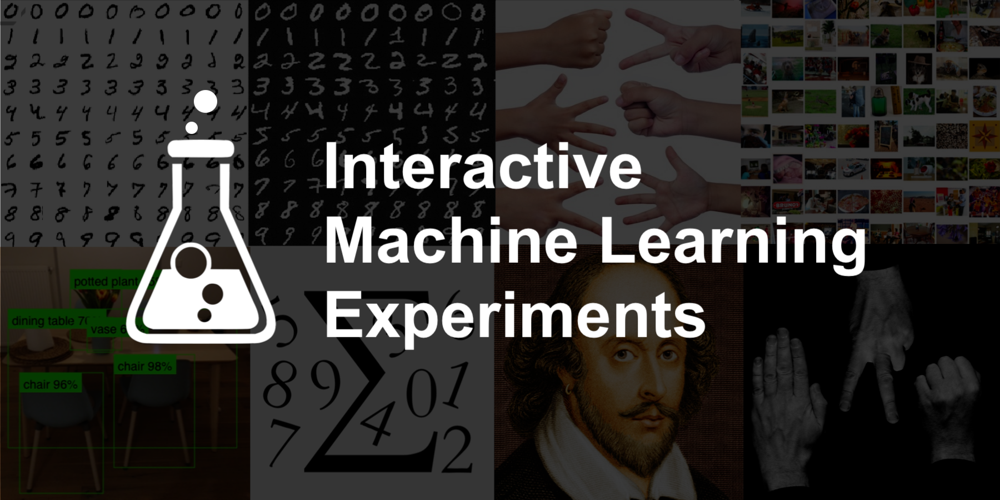

# 🤖 Interactive Machine Learning Experiments

## TL;DR

Hey readers!

I've open-sourced a new [**🤖 Interactive Machine Learning Experiments**](https://github.com/trekhleb/machine-learning-experiments) project on GitHub. Each experiment consists of 🏋️ _Jupyter/Colab notebook_ (to see how a model was trained) and 🎨 _demo page_ (to see a model in action right in your browser). Most of the models in these experiments were trained using _TensorFlow 2_ with _Keras_ support.

Although the models may be a little dumb (remember, these are just experiments, not a production ready code), they will try to do their best to:

- Recognize digits or sketches you draw in your browser
- Play with you in Rock-Paper-Scissors game
- Detect and recognize the objects you'll show to your camera
- Classify your uploaded image
- Write a Shakespeare poem with you
- etc. 

## Background

NanoNeuron
https://github.com/trekhleb/nano-neuron
7 simple JavaScript functions that will give you a feeling of how machines can actually "learn".

Playground and Cheatsheet for Learning Python
https://github.com/trekhleb/learn-python
Collection of Python scripts that are split by topics and contain code examples with explanations.

Homemade Machine Learning
https://github.com/trekhleb/homemade-machine-learning
Python examples of popular machine learning algorithms with interactive Jupyter demos and math being explained.

## Tech-stack
